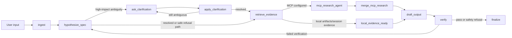

# mutual-spec-agent

An ADK Python 2.x prototype for a **Mutual Specification Game** agent: instead of answering immediately, the agent builds a shared task specification, asks for clarification when the executable task is under-specified, retrieves evidence, drafts the output, verifies it, and either finalizes or loops once for repair.

This project was created with the current Agents CLI workflow and then adapted to ADK 2.x graph workflows. It is intended as an MVP, not a production-complete agent service.

## What It Does

`mutual-spec-agent` minimizes the gap between a user's latent task and an executable task specification.

The agent:

- Stores a compact shared specification ledger in `session.state["spec_ledger"]`.
- Uses ADK artifacts for uploaded files, PDFs, and images, keeping binary data out of session state.
- Requests human clarification when goal, audience, or output format is materially ambiguous.
- Retrieves evidence through artifact references and optional MCP research tools.
- Optionally ranks uploaded text, image, audio, video, and PDF artifacts with Gemini multimodal embeddings.
- Records Python-side model routing decisions for cheap, strong, and verifier routes.
- Verifies final output for spec gaps, unsupported claims, trajectory coverage, and safety issues.
- Runs locally with `adk web`.
- Includes Agent Runtime deployment support and optional Cloud Run deployment.

## Architecture

The core workflow is an ADK 2.x graph. ADK graph workflows provide explicit execution nodes and edges, which is a better fit for deterministic specification, evidence, and verification stages than a single prompt-only agent. See the ADK graph workflow docs for the underlying API and rationale. [1]



## Repository Layout

```text
.
├── app/
│   ├── agent.py              # ADK app entrypoint and BigQuery analytics hook
│   ├── agent_runtime_app.py  # Agent Runtime wrapper
│   ├── workflow.py           # ADK 2.x graph workflow and MCP tool wiring
│   ├── spec_state.py         # Serializable session.state ledger schema
│   ├── router.py             # Python-side model routing policy
│   └── verifiers.py          # Quality, hallucination, trajectory, and safety checks
├── deploy/
│   └── deploy_runtime.py     # Agent Runtime and optional Cloud Run deployment
├── tests/
│   ├── test_acceptance.py    # Deterministic acceptance tests
│   └── eval/
│       ├── eval_config.json
│       ├── metrics.py        # Custom ADK eval metrics
│       └── evalsets/msg_mvp.evalset.json
├── DESIGN_SPEC.md
├── agents-cli-manifest.yaml
├── pyproject.toml
└── README.md
```

## Requirements

- Python `>=3.11,<3.14`
- `uv`
- Google ADK Python 2.x
- Optional: `uvx google-agents-cli` for Agents CLI workflows
- Optional for deployment: Google Cloud SDK plus a Google Cloud project with billing enabled

Install dependencies:

```bash
uv sync --extra eval
```

The `eval` extra is needed for `adk eval`.

## Local Development

Run the acceptance test suite:

```bash
uv run pytest
```

Run the local ADK web UI:

```bash
uv run adk web app
```

For a fully in-memory smoke run:

```bash
uv run adk web app \
  --session_service_uri=memory:// \
  --artifact_service_uri=memory://
```

ADK documents `adk web` as the browser-based local development interface for interacting with agents. [2]

## Evaluations

Run the ADK eval set:

```bash
uv run adk eval app tests/eval/evalsets/msg_mvp.evalset.json \
  --config_file_path tests/eval/eval_config.json \
  --print_detailed_results
```

This repo includes custom metrics for:

- `clarification_behavior`
- `tool_trajectory`
- `final_response_quality`
- `hallucination_control`
- `safety`

ADK evaluation supports both final-response checks and trajectory-oriented agent evaluation, which is why this project keeps separate tests for clarification, tool/evidence path, response quality, hallucination control, and safety. [3]

Latest local verification:

```text
uv run pytest
# 12 passed

.venv/bin/ruff check .
# All checks passed

.venv/bin/adk eval app tests/eval/evalsets/msg_mvp.evalset.json \
  --config_file_path tests/eval/eval_config.json \
  --print_detailed_results
# msg_mvp: Tests passed: 3, Tests failed: 0
```

## State and Artifacts Contract

The specification ledger is serialized under:

```text
session.state["spec_ledger"]
```

It stores JSON-safe data only:

- accepted goal, audience, and output format
- constraints, assumptions, and success criteria
- ambiguity records and clarification questions
- evidence references and evidence IDs
- route history and workflow trajectory
- verifier findings

Uploaded files, PDFs, and images are stored with ADK artifact services. The ledger stores only metadata such as filename, MIME type, artifact ID, and artifact version. This follows ADK's separation between session state and artifacts. [4] [5]

## MCP Research Tools

External retrieval is optional and configured through environment variables:

```bash
# Streamable HTTP MCP server
export MCP_RESEARCH_URL=https://your-mcp-server.example.com/mcp

# or stdio MCP server
export MCP_RESEARCH_COMMAND="npx -y @modelcontextprotocol/server-fetch"
export MCP_RESEARCH_CWD=/optional/server/working/directory
```

When MCP is configured, the workflow routes through `mcp_research_agent`, which is built with ADK's `McpToolset`. ADK supports MCP tools for connecting agents to external tool servers over stdio or remote transports. [6]

## Multimodal Retrieval

The repo now includes an optional Gemini multimodal retrieval layer based on the "Gemini Embedding 2 - Complete Guide" Colab pattern: embed text, images, audio, video, and PDFs into one vector space, rank with cosine similarity, and keep lower dimensions for cost and latency control.

When enabled, `retrieve_evidence` loads ADK artifacts, embeds eligible artifact parts, ranks them against the user request, and records `multimodal:*` evidence IDs in the spec ledger. Without Google credentials, this layer stays disabled and local tests remain deterministic.

See [docs/GEMINI_PLATFORM_GREEN_BOXES.md](docs/GEMINI_PLATFORM_GREEN_BOXES.md) and [.env.example](.env.example) for the grant-backed platform configuration.

## Google Cloud `.env` Setup

Use this when running against the Google account/project that has the grant. The Google Cloud Console gives you the project ID, bucket names, BigQuery dataset ID, and Model Armor template ID. Local authentication still needs one browser-based `gcloud` login so the code can use Application Default Credentials from this machine.

Recommended `.env`:

```bash
GOOGLE_CLOUD_PROJECT=your-project-id
GOOGLE_CLOUD_LOCATION=us-central1
GOOGLE_GENAI_USE_VERTEXAI=true

MULTIMODAL_RETRIEVAL_ENABLED=true
MULTIMODAL_EMBEDDING_MODEL=gemini-embedding-2
MULTIMODAL_OUTPUT_DIMENSIONALITY=768
MULTIMODAL_MAX_ARTIFACT_BYTES=4000000
MULTIMODAL_MAX_RESULTS=5
MULTIMODAL_MIN_SIMILARITY=0.0
MULTIMODAL_ALLOWED_MIME_TYPES=application/json,application/pdf,image/,audio/,video/,text/
MULTIMODAL_DOCUMENT_OCR=true
MULTIMODAL_AUDIO_TRACK_EXTRACTION=true

MODEL_ARMOR_TEMPLATE_ID=default-agent-policy
MODEL_ARMOR_LOCATION=us-central1
MODEL_ARMOR_TIMEOUT_SECONDS=5
MODEL_ARMOR_FAIL_CLOSED=false
MODEL_ARMOR_MULTI_LANGUAGE_DETECTION=true

BQ_ANALYTICS_ENABLED=true
BQ_ANALYTICS_DATASET_ID=adk_agent_analytics
BQ_ANALYTICS_GCS_BUCKET=your-globally-unique-analytics-bucket
ARTIFACTS_GCS_BUCKET=your-globally-unique-artifacts-bucket

MUTUAL_SPEC_CHEAP_MODEL=gemini-flash-latest
MUTUAL_SPEC_STRONG_MODEL=gemini-pro-latest
MUTUAL_SPEC_VERIFIER_MODEL=gemini-pro-latest
```

### Get Values In Google Cloud Console

1. Open `https://console.cloud.google.com/` and select the grant-backed project from the project selector in the top bar. Copy the `Project ID`, not the project name or project number, into `GOOGLE_CLOUD_PROJECT`. Google documents project ID as the unique project identifier used inside the console. [12]
2. Check that billing is attached to the grant account: open `Billing`, then `My projects`, and confirm the selected project is linked to the billing account or grant credits.
3. Pick one region and use it consistently. This README uses `us-central1`, so set `GOOGLE_CLOUD_LOCATION=us-central1` and `MODEL_ARMOR_LOCATION=us-central1`. If you already deployed in another supported region, use that same region everywhere.
4. Enable APIs from the console: open `APIs & Services`, then `Library`, search for each API, open it, and click `Enable`. Google documents this as the standard console flow for enabling APIs. [13]
5. Enable these APIs for the full green-box path: `Vertex AI API`, `Model Armor API`, `BigQuery API`, `Cloud Logging API`, `Cloud Storage`, `Cloud Run Admin API`, `Cloud Build API`, and `Artifact Registry API`.
6. Create the artifacts bucket: open `Cloud Storage`, then `Buckets`, click `Create`, enter a globally unique name such as `your-project-id-adk-artifacts`, choose the same region or a compatible multi-region, keep Standard storage, and finish creation. Copy only the bucket name into `ARTIFACTS_GCS_BUCKET`; do not include `gs://`. Google notes that the bucket name is set at creation and must be globally unique. [14]
7. Create the analytics bucket the same way, for example `your-project-id-adk-analytics`, and copy the bucket name into `BQ_ANALYTICS_GCS_BUCKET`.
8. Create the BigQuery dataset: open `BigQuery`, use the `Explorer` pane, select your project, click the project actions menu, choose `Create dataset`, set Dataset ID to `adk_agent_analytics`, choose the location, and click `Create dataset`. Copy only the dataset ID into `BQ_ANALYTICS_DATASET_ID`. Google notes dataset location is fixed after creation. [15]
9. Create the Model Armor template: open `Model Armor`, verify the same project is selected, click `Create Template`, set Template ID to `default-agent-policy`, choose `us-central1`, configure detections for prompt injection/jailbreak, malicious URI, sensitive data, and responsible AI safety, then save. Copy the Template ID into `MODEL_ARMOR_TEMPLATE_ID`. Google documents that template IDs can contain letters, digits, or hyphens, cannot contain spaces, and cannot exceed 63 characters. [16]
10. If you prefer the full Model Armor resource instead of separate ID/location variables, set `MODEL_ARMOR_TEMPLATE=projects/your-project-id/locations/us-central1/templates/default-agent-policy`.
11. Authenticate the local repo to the same Google account. This opens a Google browser sign-in and writes local Application Default Credentials:

```bash
gcloud auth login
gcloud auth application-default login
gcloud config set project "$GOOGLE_CLOUD_PROJECT"
```

After creating `.env`, load it before local runs:

```bash
set -a
source .env
set +a
```

For local development, keep `MODEL_ARMOR_FAIL_CLOSED=false` so temporary auth or quota issues do not block all prompts. For deployed production behavior, use `MODEL_ARMOR_FAIL_CLOSED=true`.

## Model Routing

Routing is implemented in Python rather than through an experimental router abstraction:

```bash
export MUTUAL_SPEC_CHEAP_MODEL=gemini-flash-latest
export MUTUAL_SPEC_STRONG_MODEL=gemini-pro-latest
export MUTUAL_SPEC_VERIFIER_MODEL=gemini-pro-latest
```

Routing policy:

- Cheap route: low-risk classification, extraction, and summarization.
- Strong route: high-ambiguity synthesis and failed-verification repair.
- Verifier route: independent pass after drafting.

Every routing decision is recorded in the spec ledger as a serializable `RouteRecord`.

## Safety Behavior

Unsafe requests for phishing, credential theft, malware, ransomware, or evasion bypass clarification and finalize with a refusal. Benign tasks continue through the specification workflow.

The local safety policy is intentionally simple for the MVP. Production use can enable Google Cloud Model Armor with `MODEL_ARMOR_TEMPLATE` or `MODEL_ARMOR_TEMPLATE_ID`; the verifier screens user prompts through Model Armor first and falls back to the local policy when Model Armor is not configured.

## Agents CLI

This project follows the Agents CLI lifecycle for create, evaluate, and deploy work. The public Agents CLI repo describes it as a CLI and skill set for building, evaluating, and deploying ADK agents on Google Cloud, including support for Codex and other coding agents. [7]

Useful commands:

```bash
uvx google-agents-cli setup
uvx google-agents-cli create mutual-spec-agent --adk --prototype --deployment-target agent_runtime --bq-analytics
uvx google-agents-cli playground
uvx google-agents-cli eval run
uvx google-agents-cli deploy
```

The command surface can change across Agents CLI versions. In this environment, `uvx google-agents-cli create --help` exposed `create`, `playground`, `eval`, and `deploy`.

## Deployment

### Agent Runtime

Agent Runtime is ADK's managed Google Cloud deployment target for scalable production agents. The ADK docs describe Agent Runtime as a managed runtime environment for ADK agent code. [8]

Deploy through this repo's script:

```bash
export GOOGLE_CLOUD_PROJECT=your-project
export GOOGLE_CLOUD_LOCATION=us-east1

uv run python deploy/deploy_runtime.py --target agent-runtime
```

The script wraps the ADK app with `vertexai.agent_engines.templates.adk.AdkApp` in `app/agent_runtime_app.py`.

You can also use Agents CLI deployment after configuring your project:

```bash
uvx google-agents-cli deploy
```

ADK also documents an Agents CLI path for preparing and deploying ADK projects to Agent Runtime. [9]

### Optional Cloud Run

Cloud Run is available for container-style deployment. ADK documents `adk deploy cloud_run` as the recommended Python path for Cloud Run deployment. [10]

```bash
export GOOGLE_CLOUD_PROJECT=your-project
export GOOGLE_CLOUD_LOCATION=us-east1

uv run python deploy/deploy_runtime.py \
  --target cloud-run \
  --project "$GOOGLE_CLOUD_PROJECT" \
  --region "$GOOGLE_CLOUD_LOCATION"
```

## Observability

The app supports optional BigQuery Agent Analytics through `app/agent.py`:

```bash
export BQ_ANALYTICS_ENABLED=true
export GOOGLE_CLOUD_PROJECT=your-project
export GOOGLE_CLOUD_LOCATION=us-east1
export BQ_ANALYTICS_DATASET_ID=adk_agent_analytics
export BQ_ANALYTICS_GCS_BUCKET=your-bucket
```

The Agent Runtime wrapper also enables ADK/Google Cloud telemetry defaults and supports GCS-backed artifacts:

```bash
export ARTIFACTS_GCS_BUCKET=your-artifact-bucket
```

ADK's deployment overview notes Google Cloud deployment targets can inherit managed infrastructure, authentication, Cloud Trace observability, and security features. [11]

## GitHub Push Checklist

Before pushing:

```bash
uv sync --extra eval
uv run pytest
uv run adk eval app tests/eval/evalsets/msg_mvp.evalset.json \
  --config_file_path tests/eval/eval_config.json \
  --print_detailed_results
.venv/bin/ruff check .
```

Generated local files are ignored:

- `.venv/`
- `.pytest_cache/`
- `.ruff_cache/`
- `__pycache__/`
- `app/.adk/`

## Design Notes

See [DESIGN_SPEC.md](DESIGN_SPEC.md) for the implementation contract, workflow rationale, and detailed state/evidence behavior.

## Documentation Citations

1. [ADK graph-based workflows](https://adk.dev/graphs/)
2. [ADK runtime and `adk web`](https://adk.dev/runtime/)
3. [ADK evaluation](https://adk.dev/evaluate/)
4. [ADK session state](https://adk.dev/sessions/state/)
5. [ADK artifacts](https://adk.dev/artifacts/)
6. [ADK MCP tools](https://adk.dev/tools-custom/mcp-tools/)
7. [Google Agents CLI GitHub repository](https://github.com/google/agents-cli)
8. [ADK Agent Runtime deployment overview](https://adk.dev/deploy/agent-runtime/)
9. [Deploy to Agent Runtime with Agents CLI](https://adk.dev/deploy/agent-runtime/agents-cli/)
10. [ADK Cloud Run deployment](https://adk.dev/deploy/cloud-run/)
11. [ADK deployment overview](https://adk.dev/deploy/)
12. [Locate the Google Cloud project ID](https://support.google.com/googleapi/answer/7014113)
13. [Enable APIs in the Google API Console](https://support.google.com/googleapi/answer/6158841)
14. [Create a Cloud Storage bucket](https://docs.cloud.google.com/storage/docs/creating-buckets)
15. [Create BigQuery datasets](https://cloud.google.com/bigquery/docs/datasets)
16. [Create and manage Model Armor templates](https://docs.cloud.google.com/model-armor/manage-templates)
