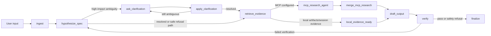

# mutual-spec-agent

An ADK Python 2.x prototype for a **Mutual Specification Game** agent: instead of optimizing for "the best answer to the prompt," the agent optimizes for convergence between the user's latent intent, the expressed query, and an executable, verifiable task specification.

This project was created with the current Agents CLI workflow and then adapted to ADK 2.x graph workflows. It is intended as an MVP, not a production-complete agent service.

## What It Does

`mutual-spec-agent` minimizes the gap between a user's latent task and an executable task specification.

The agent:

- Treats a user query as a lossy signal of a richer latent task.
- Stores a compact shared specification ledger in `session.state["spec_ledger"]`.
- Uses ADK artifacts for uploaded files, PDFs, and images, keeping binary data out of session state.
- Requests human clarification when goal, audience, or output format is materially ambiguous.
- Retrieves evidence through artifact references and optional MCP research tools.
- Optionally ranks uploaded text, image, audio, video, and PDF artifacts with Gemini multimodal embeddings.
- Records Python-side model routing decisions for cheap, strong, and verifier routes.
- Formalizes the ledger as local problem/question/answer tasks with deterministic obligation checks.
- Documents a future region-aware telemetry layer for routing across both models and Google Cloud regions.
- Verifies final output for spec gaps, unsupported claims, trajectory coverage, and safety issues.
- Runs locally with `adk web`.
- Includes Agent Runtime deployment support and optional Cloud Run deployment.

## Mutual Specification Game

The system treats task formation as a staged composition of games:

- Elicitation is a cooperative partial-information game.
- Dialogue is a signaling and commitment game under asymmetric information.
- Retrieval is an evidence-selection game.
- Decision planning is a full-information graph game with explicit success, verification, safety, and budget conditions.

The shared specification, not the answer text, is the coordination object. The agent should ask, retrieve, route, draft, verify, or refuse based on expected specification gain and risk reduction.

See [docs/design/mutual_specification_game.md](docs/design/mutual_specification_game.md) for the full design contract.

## Trader Decision-State Focus

Traders are the target high-value users because their prompts are compressed, high-stakes, and ambiguous signals of latent strategies under incomplete information. The agent's job is not to answer a trading query directly and not to execute. It should reconstruct, test, and verify the trade, analysis, alert, or strategy specification so the trader can decide.

Use this mapping:

```text
theta = the real trading task
q     = what the trader said in chat
s     = executable specification of the trade, analysis, alert, or strategy
```

The prompt `q` is often extremely lossy: "look at HO/RB arb", "Brent/WTI bounce?", "can we route through Turkey?", "give me risk on this spread." The hidden task `theta` may really be physical arbitrage, counterparty verification, sanctions risk, basis risk, logistics feasibility, partner explanation, or checking whether the trader is self-confirming a bad thesis.

The local Brent system at `/Users/pauldudko/VSProjects/brent_strategy` is the reference instruction pattern for trader sources and validation discipline:

- IBKR is a market-data/history source for this agent. Do not place orders, manage execution, or present an execution workflow.
- Yahoo Finance is a free reference/proxy source, such as OVX for an implied-volatility proxy. Label proxy transforms and calibration assumptions.
- ClickHouse and JSONL streams are audit surfaces for data snapshots, simulated PnL, source rows, assumptions, and reproducible metrics.
- Sparta, Improm, ZenPulsar, Refinitiv/Enel, EIA, and similar feeds must be tracked with freshness, entitlement, units, transform, confidence, and lookahead controls.

For trader tasks, the specification must include instrument mapping, side/legs if relevant, horizon, sizing or risk frame, data-source contract, legal/logistics/market risk flags, validation criteria, assumptions, falsification triggers, and audit requirements. The output is a decision frame for the trader, not a buy/sell recommendation.

## Architecture

The core workflow is an ADK 2.x graph. ADK graph workflows provide explicit execution nodes and edges, which is a better fit for deterministic specification, evidence, and verification stages than a single prompt-only agent. See the ADK graph workflow docs for the underlying API and rationale. [1]



## Repository Layout

```text
.
├── app/
│   ├── agent.py              # ADK app entrypoint and BigQuery analytics hook
│   ├── agent_runtime_app.py  # Agent Runtime wrapper
│   ├── workflow.py           # ADK 2.x graph workflow and MCP tool wiring
│   ├── spec_state.py         # Serializable session.state ledger schema
│   ├── formalization.py      # Problem/question/answer task formalization checks
│   ├── telemetry/            # Explicit GCP resource-region collectors
│   ├── router.py             # Python-side model routing policy
│   └── verifiers.py          # Quality, hallucination, trajectory, and safety checks
├── deploy/
│   └── deploy_runtime.py     # Agent Runtime and optional Cloud Run deployment
├── config/
│   └── region_power_map.example.yaml
├── sql/
│   ├── gcp_resource_billing_hourly.example.sql
│   └── resource_region_criteria_view.example.sql
├── docs/
│   └── design/
│       ├── mutual_specification_game.md
│       └── gcp_compute_electricity_spread.md
├── tests/
│   ├── test_acceptance.py    # Deterministic acceptance tests
│   └── eval/
│       ├── eval_config.json
│       ├── metrics.py        # Custom ADK eval metrics
│       └── evalsets/msg_mvp.evalset.json
├── DESIGN_SPEC.md
├── agents-cli-manifest.yaml
├── pyproject.toml
└── README.md
```

## Requirements

- Python `>=3.11,<3.14`
- `uv`
- Google ADK Python 2.x
- Optional: `uvx google-agents-cli` for Agents CLI workflows
- Optional for deployment: Google Cloud SDK plus a Google Cloud project with billing enabled

Install dependencies:

```bash
uv sync --extra eval
```

The `eval` extra is needed for `adk eval`.

## Local Development

Run the acceptance test suite:

```bash
uv run pytest
```

Run the local ADK web UI:

```bash
uv run adk web app
```

Run the basic terminal dashboard:

```bash
uv run mutual-spec-dashboard --text "look at HO/RB arb and give me risk on this spread"
```

Inspect resource-region telemetry configuration without calling Google Cloud:

```bash
uv run mutual-spec-telemetry status
```

For deterministic plain output without ANSI color:

```bash
uv run mutual-spec-dashboard \
  --no-color \
  --output-tokens 1200 \
  --text "Brent/WTI bounce?"
```

The dashboard is a local frontend command line. It does not call Google Cloud, IBKR, Yahoo Finance, or any network source. It reads `.env` values and shows:

- `q`, `theta`, and `s` for the Mutual Specification Game.
- Design surfaces in green when implemented/configured and red when missing or future-only.
- Google services and model routes in blue when configured and red when missing.
- Estimated token spend and electricity proxy spend from local coefficients.
- Loss and multicriteria domination parameters for `route_loss(model, region)`.

Use these `.env` coefficients to tune the estimates:

```bash
CLI_ESTIMATED_OUTPUT_TOKENS=800
TOKEN_USD_PER_1K_INPUT=0
TOKEN_USD_PER_1K_OUTPUT=0
ENERGY_WH_PER_1K_TOKENS=0.2
POWER_PRICE_USD_PER_MWH=80
TELEMETRY_PUE=1.10
LOSS_DECISION_RULE=pareto_nondominated
LOSS_LATENCY_EPSILON_MS=250
LOSS_MODEL_QUALITY_EPSILON=0.05
LOSS_COST_EPSILON_USD=0.01
LOSS_COMPUTE_SPREAD_STRESS_EPSILON_USD=0.01
LOSS_LOW_CONFIDENCE_PENALTY=0.50
TELEMETRY_WATTS_PER_VCPU=8.0
TELEMETRY_WATTS_PER_GPU=300.0
TELEMETRY_WATTS_PER_TPU=300.0
```

For a fully in-memory smoke run:

```bash
uv run adk web app \
  --session_service_uri=memory:// \
  --artifact_service_uri=memory://
```

ADK documents `adk web` as the browser-based local development interface for interacting with agents. [2]

## Evaluations

Run the ADK eval set:

```bash
uv run adk eval app tests/eval/evalsets/msg_mvp.evalset.json \
  --config_file_path tests/eval/eval_config.json \
  --print_detailed_results
```

This repo includes custom metrics for:

- `clarification_behavior`
- `tool_trajectory`
- `final_response_quality`
- `hallucination_control`
- `safety`

ADK evaluation supports both final-response checks and trajectory-oriented agent evaluation, which is why this project keeps separate tests for clarification, tool/evidence path, response quality, hallucination control, and safety. [3]

Latest local verification:

```text
uv run pytest
# expected: all tests pass

.venv/bin/ruff check .
# All checks passed

.venv/bin/adk eval app tests/eval/evalsets/msg_mvp.evalset.json \
  --config_file_path tests/eval/eval_config.json \
  --print_detailed_results
# msg_mvp: Tests passed: 3, Tests failed: 0
```

## State and Artifacts Contract

The specification ledger is serialized under:

```text
session.state["spec_ledger"]
```

It stores JSON-safe data only:

- accepted goal, audience, and output format
- constraints, assumptions, and success criteria
- ambiguity records and clarification questions
- evidence references and evidence IDs
- route history and workflow trajectory
- verifier findings

Uploaded files, PDFs, and images are stored with ADK artifact services. The ledger stores only metadata such as filename, MIME type, artifact ID, and artifact version. This follows ADK's separation between session state and artifacts. [4] [5]

## MCP Research Tools

External retrieval is optional and configured through environment variables:

```bash
# Local Opoint stdio MCP server
export OPOINT_API_KEY=your-opoint-api-key
export MCP_RESEARCH_COMMAND="uv run opoint-mcp"
export MCP_RESEARCH_CWD=/Users/pauldudko/VSProjects/mcp_opoint

# or streamable HTTP MCP server
# export MCP_RESEARCH_URL=https://your-mcp-server.example.com/mcp
```

When MCP is configured, the workflow routes through `mcp_research_agent`, which is built with ADK's `McpToolset`. ADK supports MCP tools for connecting agents to external tool servers over stdio or remote transports. [6]

## Async Escalation Jobs

The light route can hand off high-gain work to a local async queue instead of
doing all expensive retrieval and verification in the first turn. This is
disabled by default so local evals stay deterministic.

```bash
export ASYNC_JOB_ENABLED=true
export ASYNC_JOB_STORE_PATH=app/.adk/async_jobs.jsonl
```

When enabled, trader prompts, failed verifier loops, artifact-heavy requests,
MCP/Opoint research, or resource-region telemetry contexts can enqueue a
`deep_research_and_verification` job. The job envelope records the current
ledger, route reasons, expected specification gain, recent model routes, and
formalization obligations. The first implementation is append-only JSONL under
`app/.adk/`; later it can move to Pub/Sub, Cloud Tasks, Cloud Run Jobs, or
BigQuery without changing the route decision contract.

Inspect local jobs:

```bash
uv run mutual-spec-jobs list
uv run mutual-spec-jobs list --pending
```

Mark a local job complete after an external worker or manual analysis returns:

```bash
uv run mutual-spec-jobs complete job-abc123 \
  --result-ref local://result/job-abc123 \
  --summary "Verified decision frame ready for review."
```

## Multimodal Retrieval

The repo now includes an optional Gemini multimodal retrieval layer based on the "Gemini Embedding 2 - Complete Guide" Colab pattern: embed text, images, audio, video, and PDFs into one vector space, rank with cosine similarity, and keep lower dimensions for cost and latency control.

When enabled, `retrieve_evidence` loads ADK artifacts, embeds eligible artifact parts, ranks them against the user request, and records `multimodal:*` evidence IDs in the spec ledger. Without Google credentials, this layer stays disabled and local tests remain deterministic.

See [docs/GEMINI_PLATFORM_GREEN_BOXES.md](docs/GEMINI_PLATFORM_GREEN_BOXES.md) and [.env.example](.env.example) for the grant-backed platform configuration.

## Google Cloud `.env` Setup

Use this when running against the Google account/project that has the grant. The Google Cloud Console gives you the project ID, bucket names, BigQuery dataset ID, and Model Armor template ID. Local authentication still needs one browser-based `gcloud` login so the code can use Application Default Credentials from this machine.

Recommended `.env`:

```bash
GOOGLE_CLOUD_PROJECT=your-project-id
GOOGLE_CLOUD_LOCATION=us-central1
GOOGLE_GENAI_USE_VERTEXAI=true

MULTIMODAL_RETRIEVAL_ENABLED=true
MULTIMODAL_EMBEDDING_MODEL=gemini-embedding-001
MULTIMODAL_OUTPUT_DIMENSIONALITY=768
MULTIMODAL_MAX_ARTIFACT_BYTES=4000000
MULTIMODAL_MAX_RESULTS=5
MULTIMODAL_MIN_SIMILARITY=0.0
MULTIMODAL_ALLOWED_MIME_TYPES=application/json,application/pdf,image/,audio/,video/,text/
MULTIMODAL_DOCUMENT_OCR=true
MULTIMODAL_AUDIO_TRACK_EXTRACTION=true

MODEL_ARMOR_TEMPLATE_ID=default-agent-policy
MODEL_ARMOR_LOCATION=us-central1
MODEL_ARMOR_TIMEOUT_SECONDS=5
MODEL_ARMOR_FAIL_CLOSED=false
MODEL_ARMOR_MULTI_LANGUAGE_DETECTION=true

BQ_ANALYTICS_ENABLED=true
BQ_ANALYTICS_DATASET_ID=adk_agent_analytics
BQ_ANALYTICS_GCS_BUCKET=your-globally-unique-analytics-bucket
ARTIFACTS_GCS_BUCKET=your-globally-unique-artifacts-bucket

RESOURCE_REGION_DOMINATION_ENABLED=true
RESOURCE_TELEMETRY_COLLECTORS_ENABLED=true
TELEMETRY_DATASET_ID=telemetry
TELEMETRY_LOCATION=US
GCP_ASSET_CHANGES_TOPIC=gcp-all-resource-changes
GCP_ASSET_CHANGES_SUBSCRIPTION=gcp-all-resource-changes-sub
GCP_ASSET_EVENTS_TABLE=gcp_asset_events
GCP_COMPUTE_METRICS_TABLE=gcp_compute_metrics
POWER_PRICES_TABLE=region_power_prices
GCP_RESOURCE_BILLING_VIEW=gcp_resource_billing_hourly
RESOURCE_REGION_CRITERIA_VIEW=resource_region_criteria_by_hour
REGION_POWER_MAP_PATH=config/region_power_map.example.yaml
POWER_PRICE_SOURCE=static_region_power_map
# GRIDSTATUS_API_KEY=your-gridstatus-key
# EIA_API_KEY=your-eia-key

ASYNC_JOB_ENABLED=false
ASYNC_JOB_STORE_PATH=app/.adk/async_jobs.jsonl

MUTUAL_SPEC_CHEAP_MODEL=gemini-3.5-flash
MUTUAL_SPEC_STRONG_MODEL=gemini-3.5-flash
MUTUAL_SPEC_VERIFIER_MODEL=gemini-3.5-flash
```

### Turn On Checklist

Do these in order. The first group is required for the current multimodal ADK agent; the second group is for deployment and observability; the third group is for the all-resource region domination telemetry collectors.

1. Create or select the Google Cloud project that has the grant attached.
2. Confirm billing/grant credits are linked to that project.
3. Enable the core agent APIs in `Google Cloud Console -> APIs & Services -> Library`:

| Console API name | API ID | Why this repo needs it |
| --- | --- | --- |
| Vertex AI API | `aiplatform.googleapis.com` | Gemini model calls through Vertex AI / Google account auth. |
| Model Armor API | `modelarmor.googleapis.com` | Optional prompt and response safety screening. |
| BigQuery API | `bigquery.googleapis.com` | ADK analytics, billing export, and telemetry views. |
| Cloud Storage | `storage.googleapis.com` | GCS-backed ADK artifacts and analytics payload storage. |
| Cloud Logging API | `logging.googleapis.com` | Runtime logs and feedback events. |

4. Enable deployment APIs if you want Agent Runtime or Cloud Run:

| Console API name | API ID | Why this repo needs it |
| --- | --- | --- |
| Cloud Run Admin API | `run.googleapis.com` | Optional Cloud Run deployment. |
| Cloud Build API | `cloudbuild.googleapis.com` | Builds deployment containers when needed. |
| Artifact Registry API | `artifactregistry.googleapis.com` | Stores deployment images/artifacts. |

5. Enable all-resource region domination telemetry APIs when you want live collector runs:

| Console API name | API ID | Why this repo will need it |
| --- | --- | --- |
| Cloud Asset API | `cloudasset.googleapis.com` | Resource change feeds for all supported Google Cloud asset types. |
| Pub/Sub API | `pubsub.googleapis.com` | Delivery channel for Cloud Asset Inventory feeds. |
| Cloud Monitoring API | `monitoring.googleapis.com` | CPU, reservation, GPU, and TPU metrics. |
| Cloud Billing API | `cloudbilling.googleapis.com` | Billing account and pricing integration. |
| Cloud Scheduler API | `cloudscheduler.googleapis.com` | Scheduled telemetry pollers. |
| Dataflow API | `dataflow.googleapis.com` | Optional streaming/batch consumer if Cloud Run is not enough. |
| BigQuery Data Transfer Service API | `bigquerydatatransfer.googleapis.com` | Required for Cloud Billing pricing export setup. |

6. Create two Cloud Storage buckets:

| Bucket | Suggested name | `.env` variable |
| --- | --- | --- |
| ADK artifacts | `your-project-id-adk-artifacts` | `ARTIFACTS_GCS_BUCKET` |
| BigQuery analytics spill/log payloads | `your-project-id-adk-analytics` | `BQ_ANALYTICS_GCS_BUCKET` |

7. Create BigQuery datasets for agent analytics and telemetry:

| Dataset ID | `.env` variable | Purpose |
| --- | --- | --- |
| `adk_agent_analytics` | `BQ_ANALYTICS_DATASET_ID` | ADK/Agent Runtime analytics. |
| `telemetry` | `TELEMETRY_DATASET_ID` | Billing export, power prices, and resource-region criteria views. |

8. Turn on Cloud Billing export to BigQuery for cost truth. In `Billing -> Billing export -> BigQuery export`, enable `Detailed usage cost data` and `Pricing data` into the telemetry BigQuery dataset. Google notes detailed export includes resource-level cost data, and pricing export writes SKU pricing data. [17]
9. Create the all-resource Cloud Asset Inventory feed and subscription:

```bash
gcloud pubsub topics create gcp-all-resource-changes \
  --project zenpulsar

gcloud pubsub subscriptions create gcp-all-resource-changes-sub \
  --topic=gcp-all-resource-changes \
  --project=zenpulsar

gcloud asset feeds create all-resource-feed \
  --project=zenpulsar \
  --pubsub-topic=projects/zenpulsar/topics/gcp-all-resource-changes \
  --asset-types='.*' \
  --content-type=resource
```

10. Initialize local collector tables and views after `.env` points at the project:

```bash
uv run mutual-spec-telemetry init-tables
uv run mutual-spec-telemetry pull-assets --limit 25
uv run mutual-spec-telemetry seed-power-prices --hours 24
uv run mutual-spec-telemetry poll-monitoring --minutes 15
uv run mutual-spec-telemetry install-views
```

11. If `pull-assets` shows a billing table named `gcp_billing_export_v1_*`, the standard billing export is alive. If you need per-resource attribution, confirm that a `gcp_billing_export_resource_v1_*` table also appears after enabling detailed export.
12. Create one Model Armor template in the same region:

| Template ID | `.env` variable |
| --- | --- |
| `default-agent-policy` | `MODEL_ARMOR_TEMPLATE_ID` |

13. Set up local Google authentication for ADK/Vertex AI:

```bash
gcloud auth login
gcloud auth application-default login
gcloud config set project "$GOOGLE_CLOUD_PROJECT"
```

ADK's Vertex AI auth path uses `GOOGLE_GENAI_USE_VERTEXAI=true`, `GOOGLE_CLOUD_PROJECT`, and `GOOGLE_CLOUD_LOCATION`, and Google documents `gcloud auth application-default login` as part of that setup. [18]

14. Install and verify the Google Agent Development Kit in this repo. This project already declares `google-adk` in `pyproject.toml`, so use `uv` instead of a global pip install:

```bash
uv sync --extra eval
.venv/bin/adk --help
```

Google's ADK Python quickstart documents `google-adk`, `adk run`, and `adk web`; for this repo use `uv run adk web app` from the repository root. [19]

15. Set up Agents CLI only if you want Google's coding-agent workflow for create/eval/deploy:

```bash
uvx google-agents-cli setup
uvx google-agents-cli eval run
uvx google-agents-cli deploy
```

Agents CLI is Google's CLI for building, evaluating, and deploying ADK agents on Google Cloud. It deploys resources in your own project, so the grant-backed project must be selected before deployment. [20]

13. Load the `.env` and run local verification:

```bash
set -a
source .env
set +a

uv run pytest
uv run adk web app
```

### Get Values In Google Cloud Console

1. Open `https://console.cloud.google.com/` and select the grant-backed project from the project selector in the top bar. Copy the `Project ID`, not the project name or project number, into `GOOGLE_CLOUD_PROJECT`. Google documents project ID as the unique project identifier used inside the console. [12]
2. Check that billing is attached to the grant account: open `Billing`, then `My projects`, and confirm the selected project is linked to the billing account or grant credits.
3. Pick one region and use it consistently. This README uses `us-central1`, so set `GOOGLE_CLOUD_LOCATION=us-central1` and `MODEL_ARMOR_LOCATION=us-central1`. If you already deployed in another supported region, use that same region everywhere.
4. Enable APIs from the console: open `APIs & Services`, then `Library`, search for each API, open it, and click `Enable`. Google documents this as the standard console flow for enabling APIs. [13]
5. Enable these APIs for the full green-box path: `Vertex AI API`, `Model Armor API`, `BigQuery API`, `Cloud Logging API`, `Cloud Storage`, `Cloud Run Admin API`, `Cloud Build API`, and `Artifact Registry API`. If you are building the all-resource region domination layer, also enable `Cloud Asset API`, `Pub/Sub API`, `Cloud Monitoring API`, `Cloud Billing API`, `Cloud Scheduler API`, `Dataflow API`, and `BigQuery Data Transfer Service API`.
6. Create the artifacts bucket: open `Cloud Storage`, then `Buckets`, click `Create`, enter a globally unique name such as `your-project-id-adk-artifacts`, choose the same region or a compatible multi-region, keep Standard storage, and finish creation. Copy only the bucket name into `ARTIFACTS_GCS_BUCKET`; do not include `gs://`. Google notes that the bucket name is set at creation and must be globally unique. [14]
7. Create the analytics bucket the same way, for example `your-project-id-adk-analytics`, and copy the bucket name into `BQ_ANALYTICS_GCS_BUCKET`.
8. Create the BigQuery datasets: open `BigQuery`, use the `Explorer` pane, select your project, click the project actions menu, choose `Create dataset`, set Dataset ID to `adk_agent_analytics`, choose the location, and click `Create dataset`. Repeat with Dataset ID `telemetry`. Copy `adk_agent_analytics` into `BQ_ANALYTICS_DATASET_ID` and `telemetry` into `TELEMETRY_DATASET_ID`. Google notes dataset location is fixed after creation. [15]
9. Enable Cloud Billing export: open `Billing`, choose the billing account, open `Billing export`, select the `BigQuery export` tab, and configure `Detailed usage cost data` plus `Pricing data` to write into the telemetry BigQuery dataset. Billing export tables can take hours to appear and are not fully retroactive in all locations. [17]
10. Create the Model Armor template: open `Model Armor`, verify the same project is selected, click `Create Template`, set Template ID to `default-agent-policy`, choose `us-central1`, configure detections for prompt injection/jailbreak, malicious URI, sensitive data, and responsible AI safety, then save. Copy the Template ID into `MODEL_ARMOR_TEMPLATE_ID`. Google documents that template IDs can contain letters, digits, or hyphens, cannot contain spaces, and cannot exceed 63 characters. [16]
11. If you prefer the full Model Armor resource instead of separate ID/location variables, set `MODEL_ARMOR_TEMPLATE=projects/your-project-id/locations/us-central1/templates/default-agent-policy`.
12. Authenticate the local repo to the same Google account. This opens a Google browser sign-in and writes local Application Default Credentials:

```bash
gcloud auth login
gcloud auth application-default login
gcloud config set project "$GOOGLE_CLOUD_PROJECT"
```

After creating `.env`, load it before local runs:

```bash
set -a
source .env
set +a
```

For local development, keep `MODEL_ARMOR_FAIL_CLOSED=false` so temporary auth or quota issues do not block all prompts. For deployed production behavior, use `MODEL_ARMOR_FAIL_CLOSED=true`.

## Model Routing

Routing is implemented in Python rather than through an experimental router abstraction:

```bash
export MUTUAL_SPEC_CHEAP_MODEL=gemini-3.5-flash
export MUTUAL_SPEC_STRONG_MODEL=gemini-3.5-flash
export MUTUAL_SPEC_VERIFIER_MODEL=gemini-3.5-flash
```

Gemini 3.5 Flash is the current default workhorse because Google announced it as generally available for the Gemini API, Google AI Studio, Gemini Enterprise Agent Platform, and Gemini Enterprise, with agentic and coding performance aimed at long-horizon workflows. If your Google Cloud project exposes a stronger Pro-family model later, override `MUTUAL_SPEC_STRONG_MODEL` and optionally `MUTUAL_SPEC_VERIFIER_MODEL`; no code change is needed.

Routing policy:

- Cheap route: low-risk classification, extraction, and summarization.
- Strong route: high-ambiguity synthesis and failed-verification repair.
- Verifier route: independent pass after drafting.

Every routing decision is recorded in the spec ledger as a serializable `RouteRecord`.

## Region-Aware Multicriteria Domination

The next routing dimension is Google Cloud region, not only Gemini model. The design skeleton in [docs/design/gcp_compute_electricity_spread.md](docs/design/gcp_compute_electricity_spread.md) describes two joined telemetry layers:

- Dynamic Google Cloud resource telemetry: Cloud Asset Inventory feeds for all supported resources, Cloud Monitoring metrics where available, Cloud Billing BigQuery export, and SKU pricing.
- Regional electricity proxy telemetry: wholesale/grid price proxies near each Google Cloud region, with confidence scores.

The caveat is central: Google Cloud does not expose the actual electricity price paid by a specific Google data center, and the app cannot choose an individual physical data center. The practical control surface is model-plus-region routing, using region power prices as a proxy signal.

The routing objective should be multicriteria domination, not a fixed weighted sum. A candidate is a model-region pair:

```text
candidate = (model, google_region)

criteria(candidate) = {
  policy_allowed,
  model_quality_risk,
  latency_ms,
  all_resource_cost,
  compute_electricity_spread_stress,
  carbon_context_penalty,
  proxy_confidence_penalty
}
```

Candidate `A` dominates candidate `B` when `A` satisfies the hard constraints, is no worse than `B` on every soft criterion within configured epsilon tolerances, and is strictly better on at least one soft criterion. The router should keep the nondominated frontier, then apply a narrow tie-break rule only when multiple candidates remain.

All billable resources contribute through `all_resource_cost`. Compute, serverless compute, AI platform, GPU, and TPU workloads also contribute through `compute_electricity_spread_stress` because they have the strongest usage-to-kWh proxy. Storage, networking, BigQuery, and managed services stay in the criteria vector through billing cost, region, carbon context, and confidence penalties until stronger energy coefficients exist.

The collector and skeleton files are:

- [config/region_power_map.example.yaml](config/region_power_map.example.yaml): example Google region to power-market proxy map.
- [sql/gcp_resource_billing_hourly.example.sql](sql/gcp_resource_billing_hourly.example.sql): all-resource billing export normalization view.
- [sql/resource_region_criteria_view.example.sql](sql/resource_region_criteria_view.example.sql): joined resource-region criteria view for multicriteria domination.
- [app/telemetry/asset_consumer.py](app/telemetry/asset_consumer.py): Cloud Asset Inventory Pub/Sub pull consumer.
- [app/telemetry/monitoring_poller.py](app/telemetry/monitoring_poller.py): Cloud Monitoring poller for Compute Engine CPU metrics.
- [app/telemetry/power_prices.py](app/telemetry/power_prices.py): static regional electricity proxy bootstrap.
- [app/telemetry/domination.py](app/telemetry/domination.py): Pareto/non-dominated model-region routing primitives.

The live collectors are explicit CLI operations and are not called by normal
`adk web`. Run them manually or from Cloud Scheduler/Cloud Run Jobs after the
Google-side resources exist:

```bash
uv run mutual-spec-telemetry init-tables
uv run mutual-spec-telemetry pull-assets --limit 25
uv run mutual-spec-telemetry poll-monitoring --minutes 15
uv run mutual-spec-telemetry seed-power-prices --hours 24
uv run mutual-spec-telemetry install-views
```

If Billing export created `gcp_billing_export_v1_*` first, the view installer can
use it for all-resource service/region cost. If you later enable detailed
resource export and `gcp_billing_export_resource_v1_*` appears, the installer
will prefer the detailed table pattern. You can override discovery explicitly:

```bash
uv run mutual-spec-telemetry install-views \
  --billing-table-pattern 'zenpulsar.telemetry.gcp_billing_export_v1_*'
```

This layer should not trigger deployment, trading, settlement, or execution. Use
it as a scorer/judge feature for decisions like:

```text
selected_model = gemini-3.5-flash
selected_google_region = us-south1
reason = lower estimated compute-electricity stress with acceptable latency
```

## Safety Behavior

Unsafe requests for phishing, credential theft, malware, ransomware, or evasion bypass clarification and finalize with a refusal. Benign tasks continue through the specification workflow.

The local safety policy is intentionally simple for the MVP. Production use can enable Google Cloud Model Armor with `MODEL_ARMOR_TEMPLATE` or `MODEL_ARMOR_TEMPLATE_ID`; the verifier screens user prompts through Model Armor first and falls back to the local policy when Model Armor is not configured.

## Agents CLI

This project follows the Agents CLI lifecycle for create, evaluate, and deploy work. The public Agents CLI repo describes it as a CLI and skill set for building, evaluating, and deploying ADK agents on Google Cloud, including support for Codex and other coding agents. [7]

Useful commands:

```bash
uvx google-agents-cli setup
uvx google-agents-cli create mutual-spec-agent --adk --prototype --deployment-target agent_runtime --bq-analytics
uvx google-agents-cli playground
uvx google-agents-cli eval run
uvx google-agents-cli deploy
```

The command surface can change across Agents CLI versions. In this environment, `uvx google-agents-cli create --help` exposed `create`, `playground`, `eval`, and `deploy`.

## Deployment

### Agent Runtime

Agent Runtime is ADK's managed Google Cloud deployment target for scalable production agents. The ADK docs describe Agent Runtime as a managed runtime environment for ADK agent code. [8]

Deploy through this repo's script:

```bash
export GOOGLE_CLOUD_PROJECT=your-project
export GOOGLE_CLOUD_LOCATION=us-east1

uv run python deploy/deploy_runtime.py --target agent-runtime
```

The script wraps the ADK app with `vertexai.agent_engines.templates.adk.AdkApp` in `app/agent_runtime_app.py`.

You can also use Agents CLI deployment after configuring your project:

```bash
uvx google-agents-cli deploy
```

ADK also documents an Agents CLI path for preparing and deploying ADK projects to Agent Runtime. [9]

### Optional Cloud Run

Cloud Run is available for container-style deployment. ADK documents `adk deploy cloud_run` as the recommended Python path for Cloud Run deployment. [10]

```bash
export GOOGLE_CLOUD_PROJECT=your-project
export GOOGLE_CLOUD_LOCATION=us-east1

uv run python deploy/deploy_runtime.py \
  --target cloud-run \
  --project "$GOOGLE_CLOUD_PROJECT" \
  --region "$GOOGLE_CLOUD_LOCATION"
```

## Observability

The app supports optional BigQuery Agent Analytics through `app/agent.py`:

```bash
export BQ_ANALYTICS_ENABLED=true
export GOOGLE_CLOUD_PROJECT=your-project
export GOOGLE_CLOUD_LOCATION=us-east1
export BQ_ANALYTICS_DATASET_ID=adk_agent_analytics
export BQ_ANALYTICS_GCS_BUCKET=your-bucket
```

The Agent Runtime wrapper also enables ADK/Google Cloud telemetry defaults and supports GCS-backed artifacts:

```bash
export ARTIFACTS_GCS_BUCKET=your-artifact-bucket
```

ADK's deployment overview notes Google Cloud deployment targets can inherit managed infrastructure, authentication, Cloud Trace observability, and security features. [11]

## GitHub Push Checklist

Before pushing:

```bash
uv sync --extra eval
uv run pytest
uv run adk eval app tests/eval/evalsets/msg_mvp.evalset.json \
  --config_file_path tests/eval/eval_config.json \
  --print_detailed_results
.venv/bin/ruff check .
```

Generated local files are ignored:

- `.venv/`
- `.pytest_cache/`
- `.ruff_cache/`
- `__pycache__/`
- `app/.adk/`

## Design Notes

See [DESIGN_SPEC.md](DESIGN_SPEC.md) for the implementation contract, workflow rationale, and detailed state/evidence behavior.

## Documentation Citations

1. [ADK graph-based workflows](https://adk.dev/graphs/)
2. [ADK runtime and `adk web`](https://adk.dev/runtime/)
3. [ADK evaluation](https://adk.dev/evaluate/)
4. [ADK session state](https://adk.dev/sessions/state/)
5. [ADK artifacts](https://adk.dev/artifacts/)
6. [ADK MCP tools](https://adk.dev/tools-custom/mcp-tools/)
7. [Google Agents CLI GitHub repository](https://github.com/google/agents-cli)
8. [ADK Agent Runtime deployment overview](https://adk.dev/deploy/agent-runtime/)
9. [Deploy to Agent Runtime with Agents CLI](https://adk.dev/deploy/agent-runtime/agents-cli/)
10. [ADK Cloud Run deployment](https://adk.dev/deploy/cloud-run/)
11. [ADK deployment overview](https://adk.dev/deploy/)
12. [Locate the Google Cloud project ID](https://support.google.com/googleapi/answer/7014113)
13. [Enable APIs in the Google API Console](https://support.google.com/googleapi/answer/6158841)
14. [Create a Cloud Storage bucket](https://docs.cloud.google.com/storage/docs/creating-buckets)
15. [Create BigQuery datasets](https://cloud.google.com/bigquery/docs/datasets)
16. [Create and manage Model Armor templates](https://docs.cloud.google.com/model-armor/manage-templates)
17. [Set up Cloud Billing export to BigQuery](https://docs.cloud.google.com/billing/docs/how-to/export-data-bigquery-setup)
18. [ADK model authentication quickstart](https://google.github.io/adk-docs/get-started/quickstart/)
19. [ADK Python quickstart](https://adk.dev/get-started/python/)
20. [Google Agents CLI](https://github.com/google/agents-cli)
