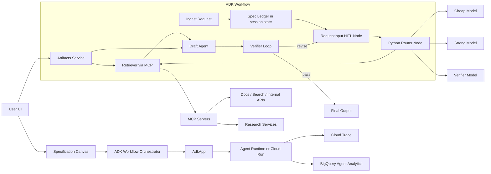

# Mutual Specification Game MVP on Google ADK

## Research foundation

In this run, the project-local evidence I could directly inspect was the seminar screenshot set you supplied in chat. On top of that, the strongest public implementation substrate for your “Mutual Specification Game” idea is Google’s Agent Development Kit because ADK is explicitly built to **build, debug, evaluate, and deploy** agents, and the current platform documentation emphasizes that it supports flexible orchestration, multi-agent composition, third-party tools, execution-trajectory evaluation, and multiple deployment targets. Just as importantly for your use case, ADK Python now supports **graph-based workflows** that combine AI reasoning with deterministic code and human-input nodes, which is a much better fit for staged specification, commitment, execution, and verification than a single prompt-only agent. citeturn9view4turn21view0turn21view1

That implementation choice is also supported by the human-AI collaboration literature. Kleinberg and coauthors show that complementarity is not something a system gets “for free”: a deterministic collaboration policy that does not effectively defer to one agent can sometimes do worse than the least accurate participant. In parallel, work on **skill-compatible AI** argues that raw strength is not enough; systems should produce actions that weaker partners can continue from. Research on overreliance and mental models reaches the same practical conclusion from another angle: cognitive forcing can reduce blind acceptance of AI advice, and behavior descriptions can improve human-AI accuracy by helping people identify failures and calibrate reliance. Together, those results strongly favor an architecture where the agent maintains a visible shared specification, pauses for high-impact ambiguity, and exposes traceable reasoning through tools, state, and verification rather than hiding everything in one fluent answer. citeturn19view0turn19view1turn18view2turn19view2turn19view4

Your model-zoo requirement also has a solid research basis. RouteLLM formalizes a practical routing problem between a **strong expensive model** and a **weaker cheaper model**, and reports that learned routers can deliver **more than 2x cost savings** with limited quality loss by reserving strong models for harder queries. The important implementation caveat is that ADK’s built-in **model routing** is currently documented as **experimental and TypeScript-only**, so for a Python-first MVP the safest path is to build routing explicitly in workflow code rather than relying on `RoutedLlm` today. citeturn18view0turn22view1

## Signals from the seminar screenshots

The first seminar code screenshot shows the simplest and still most important ADK pattern: a base `LlmAgent` with a concrete `name`, `model`, `description`, a long-form `instruction`, and an empty or minimal `tools` list. That pattern matches ADK’s core simple-agent abstraction, where the `LlmAgent` is the primary reasoning unit and the prompt-like instruction is the contract that governs how it behaves and when it should use tools. In your MVP, this should become the **Specification Agent** whose job is not to answer immediately, but to draft and maintain the shared task spec in state before handing work to downstream nodes. citeturn23search9turn9view4


The second key screenshot adds MCP wiring for Reddit research. That is exactly the right shape for your product, because ADK’s MCP integration is designed to connect an agent to external tools and services through a standard tool transport rather than bespoke wrappers. The current docs also make a production distinction that matters for your implementation plan: **stdio MCP** is best for development or simple isolated deployments, while **remote HTTP/SSE-style MCP connections** are the better fit for scalable multi-tenant production. One subtle but useful takeaway from comparing the screenshot to the docs is that the seminar code appears to use an older SSE-style parameter naming, while the current docs document the modern Python connection classes and deployment patterns. So the MVP should preserve the screenshot’s architecture but follow the **current docs’ transport classes and deployment guidance**, not copy the screenshot literally line for line. citeturn14view0turn15view3turn15view4


The UI screenshots matter just as much as the code. They show a development flow centered on ADK Web, session traces, event inspection, artifacts, and evaluation sets. That is consistent with Google’s current workflow guidance: `adk web` is a development/debugging interface rather than a production runtime; evaluation should measure **trajectory** as well as the final answer; and the local-to-managed path for production goes through `AdkApp` and Agent Platform runtime deployment. In other words, your seminar screenshots are already pointing at the right inner loop for Mutual Specification Game: **inspect the spec-building path, not only the final text**. citeturn9view1turn9view2turn26view1turn26view3

## MVP design task for Codex

The cleanest MVP is a staged ADK graph that turns your theory into explicit system behavior. The graph should do five things in order: infer a candidate shared specification, request clarification only when ambiguity is high-impact, retrieve evidence through tools, generate the artifact, and verify both the path and the output. ADK maps neatly onto those needs: graph workflows provide the deterministic skeleton, `RequestInput` provides human-in-the-loop pauses, `session.state` is the right place for a serializable specification ledger, and **artifacts** are the right place for PDFs, images, and other binaries that should not be crammed into session state. citeturn21view0turn21view1turn11view2turn9view3

A practical repository layout for Codex should look like this:

| Path | Responsibility |
|---|---|
| `app/agent.py` | Root ADK app entrypoint and local runner wiring |
| `app/workflow.py` | Graph workflow for clarify → retrieve → draft → verify |
| `app/spec_state.py` | Serializable spec ledger schema and update helpers |
| `app/router.py` | Python routing policy for model selection and escalation |
| `app/tools/` | MCP wrappers, file/tool adapters, policy helpers |
| `app/verifiers.py` | Trajectory checks, response checks, safety checks |
| `tests/eval/evalsets/msg_mvp.evalset.json` | Golden conversations and expected tool paths |
| `tests/eval/eval_config.json` | Thresholds for tool trajectory, response quality, hallucination, safety |
| `deploy/deploy_runtime.py` | Agent Runtime deployment script |
| `deploy/cloud_run/` | Optional Cloud Run deployment target |
| `DESIGN_SPEC.md` | Human-readable implementation contract for Codex |

Codex is a good fit for this because Google’s current Agents CLI workflow is explicitly designed to work with AI coding tools including **Codex**, and the documented flow already includes natural-language scaffolding, creation of a `DESIGN_SPEC.md`, eval generation, and deployment. Google’s own tutorial also shows the pattern you want to imitate: natural-language instruction to the coding assistant, scaffold the project, generate evals, then deploy. citeturn25view0turn24view2

The most useful artifact to hand to Codex is a ready-to-paste task prompt:

```text
Use agents-cli to build an ADK Python 2.0 prototype named mutual-spec-agent.

Goal:
Implement a “Mutual Specification Game” agent that minimizes the gap between the user’s latent task and the executable task specification.

Required behavior:
- Build a graph-based workflow in ADK Python 2.0.
- Stages must be: ingest -> hypothesize spec -> ask for clarification when ambiguity is high-impact -> retrieve evidence -> draft output -> verify -> either finalize or loop.
- Store the shared specification ledger in session.state as serializable JSON.
- Store uploaded files, PDFs, and images as artifacts, not in session.state.
- Add MCP-based research tools for external retrieval.
- Implement Python-side model routing in workflow code:
  - cheap model for low-risk classification, extraction, and summarization
  - strong model for high-ambiguity synthesis or failed verification
  - verifier pass after drafting
- Add explicit acceptance tests for:
  - clarification behavior
  - tool trajectory
  - final response quality
  - hallucination control
  - safety
- Provide local dev through adk web.
- Provide deployment scripts for Agent Runtime, and include optional Cloud Run support.
- Add observability hooks for traces and optional BigQuery Agent Analytics.
- Follow current ADK docs over older screenshot naming if APIs differ.

Files to create:
- app/agent.py
- app/workflow.py
- app/spec_state.py
- app/router.py
- app/verifiers.py
- tests/eval/evalsets/msg_mvp.evalset.json
- tests/eval/eval_config.json
- deploy/deploy_runtime.py
- DESIGN_SPEC.md
- README.md

Acceptance criteria:
- The agent asks a clarification question when goal, audience, or output format is materially ambiguous.
- The agent writes a spec ledger to state and updates it across turns.
- The agent can ingest artifact inputs and cite which evidence it used.
- The eval set passes trajectory and response thresholds.
- The project runs locally with adk web and exposes a deployment command for Agent Runtime.
```

That prompt deliberately mirrors the documented Agents CLI lifecycle: the coding assistant asks clarifying questions, writes the design spec, scaffolds the project, builds the agent, writes evals, and deploys it. For your use case, that is not boilerplate convenience; it is actually a first implementation of the Mutual Specification Game idea because the coding assistant itself is being forced to negotiate the spec before generating code. citeturn25view0

## Service architecture

The right architecture is a **spec-first orchestration service**, not a chat wrapper. The orchestration center should be an ADK graph, because graph workflows are specifically meant to combine deterministic execution nodes, tools, agents, and human input in a more reliable and precise process than pure prompt chaining. In your case, the graph becomes the runtime form of the staged game: a clarification stage, a retrieval stage, a drafting stage, and a verifier stage, with the shared specification persisted in state and heavy files persisted as artifacts. citeturn21view0turn21view3turn11view2turn9view3



The deployment story should preserve the seminar’s local-to-managed shape. Locally, use `adk web` for interactive debugging and trace inspection. In production, wrap the graph in `AdkApp`, which is the documented bridge for running ADK agents with sessions locally and on Agent Platform runtime. If you need lightweight external exposure quickly, keep Cloud Run as an optional target through Agents CLI; if you want managed sessions, identity, and deeper platform integration, deploy to Agent Runtime. The current quickstart shows ADK agents being wrapped in `AdkApp` and then deployed through `client.agent_engines.create(...)`, while the Agents CLI flow documents Cloud Run as a first-class deployment path for coding-assistant-driven delivery. citeturn9view1turn26view1turn26view3turn25view0

For tool integration, make MCP a separate service boundary rather than an in-process afterthought. The ADK MCP docs explicitly recommend remote MCP services for scalable production deployments and sidecar or managed patterns depending on environment. Pair that with Agent Identity for credentials: Google’s current platform guidance says agents can use Agent Identity and its auth manager to obtain external credentials securely with IAM-governed access and auditability, which is a significantly better pattern than scattering raw API keys through prompts or code. citeturn15view4turn17view4

## Routing and token strategy

For the Python MVP, treat routing as an application concern implemented in a workflow node. That recommendation follows directly from the current docs: ADK-native **agent routing** and **model routing** are both documented as **experimental** and **TypeScript-only**, while the routing literature shows the value of sending each query to exactly one model based on expected difficulty rather than querying multiple models unnecessarily. A Python router node should therefore classify the turn into one of a few paths: cheap model for intent extraction and simple rewrites, strong model for high-ambiguity synthesis, retrieval-first path for evidence-heavy work, and verifier/escalation path when the first pass fails or contradicts expectations. citeturn22view0turn22view1turn18view0

A sensible first routing policy looks like this:

| Signal | Route |
|---|---|
| Clear transform, extraction, schema fill | Cheap model |
| Missing goal, audience, or success criteria | `RequestInput` clarification |
| Tool/evidence heavy task | MCP retrieval first, then cheap summarizer |
| High-stakes synthesis or repeated draft failure | Strong model |
| Draft/verifier disagreement | Revision loop or human check |

Token efficiency should come from **structure**, not only from cheaper models. ADK’s app-level context caching is specifically meant to reduce repeated token transmission when long instructions or large reusable source packets recur; artifacts are meant for large or binary content like PDFs and images; and MCP lets the system retrieve only the evidence it needs instead of pasting whole corpora into the model context. For your use case, that means the specification ledger stays compact in state, source files live as artifacts, and retrieval stays external until the moment relevant evidence is actually needed. citeturn11view3turn9view3turn14view0turn15view4

If you want a true model zoo, the current ADK Python path is `LiteLlm`. The ADK docs describe LiteLLM as the translation layer that gives ADK access to a large number of third-party models, and the LiteLLM gateway documentation adds the operations features you actually care about in production: budgets, spend tracking, routing, fallbacks, A/B testing, logging, alerting, and metrics. That makes LiteLLM a good control plane for your model zoo, with ADK handling orchestration and LiteLLM handling provider abstraction and budget enforcement. citeturn24view0turn24view1

There is one non-negotiable safety note here. ADK’s own LiteLLM connector page carries a current security advisory about the March 2026 LiteLLM supply-chain compromise affecting versions 1.82.7 and 1.82.8, and advises immediate updating plus secret rotation if those versions were installed during the affected period. So if Codex scaffolds a model-zoo path through LiteLLM, your task spec should explicitly require **version pinning, dependency review, and secret rotation playbooks**. For runtime credentials, prefer Agent Identity and the auth manager rather than long-lived provider secrets in repo or environment sprawl. citeturn24view0turn17view4

## Evaluation and rollout

Your seminar screenshots of the Eval tab should become the required engineering discipline for this MVP. Google’s codelab on ADK evaluation lays out an “inner loop” that fits Mutual Specification Game almost perfectly: chat with the agent in ADK Web, inspect the trace rather than trusting the answer, verify the graph and request/response details, then add the session to an eval set and run it as a regression test. ADK’s evaluation docs make the same point more formally: because model behavior is probabilistic, final-answer checking is not sufficient; you need to evaluate the **trajectory** as well as the final output. citeturn28view0turn9view2turn9view1


The first evaluation gate for your MVP should therefore test three things at minimum: whether the system asked for clarification when it should have, whether it used the right tools in the right order, and whether the final answer matched the accepted specification. The ADK codelab and eval docs give you a ready-made starting point with trajectory and response metrics, and they also recommend moving up to stronger checks such as LLM-judge response matching, hallucination checks, and safety checks when deterministic overlap metrics are too brittle. citeturn28view0turn9view2

For production observability, you have two layers. The lighter one is Cloud Trace: Google’s current Agents CLI tutorial says Cloud Trace is enabled by default on deployment, which is enough for a first rollout. The deeper one is BigQuery Agent Analytics, which is unusually well aligned with your problem because it can log **LLM requests and responses, state deltas, tool provenance, multimodal content, and HITL events**. That means you can measure whether the specification game is actually converging: how many clarification turns happened, which tools were used, whether the verifier caused revisions, how much token spend each route generated, and whether multimodal inputs were actually consumed. citeturn25view0turn27view0

The most defensible MVP recommendation, based on both the current ADK stack and the seminar code direction, is this: build the first version in **ADK Python 2.0** as a **graph workflow** around a **shared spec ledger** in `session.state`; use **artifacts** for PDFs and images; attach **MCP** for evidence gathering; implement **manual Python-side routing** for the model zoo; evaluate with **golden sessions plus trajectory checks**; and operationalize the whole build through **Agents CLI**, which is already documented to work with Codex for scaffold → eval → deploy loops. That is the shortest path from your theory to a working product without flattening the theory into “just another chatbot.” citeturn21view0turn21view1turn24view0turn25view0turn26view3